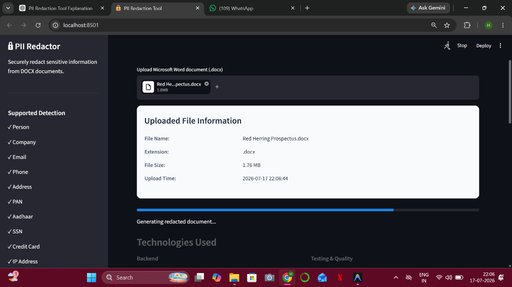
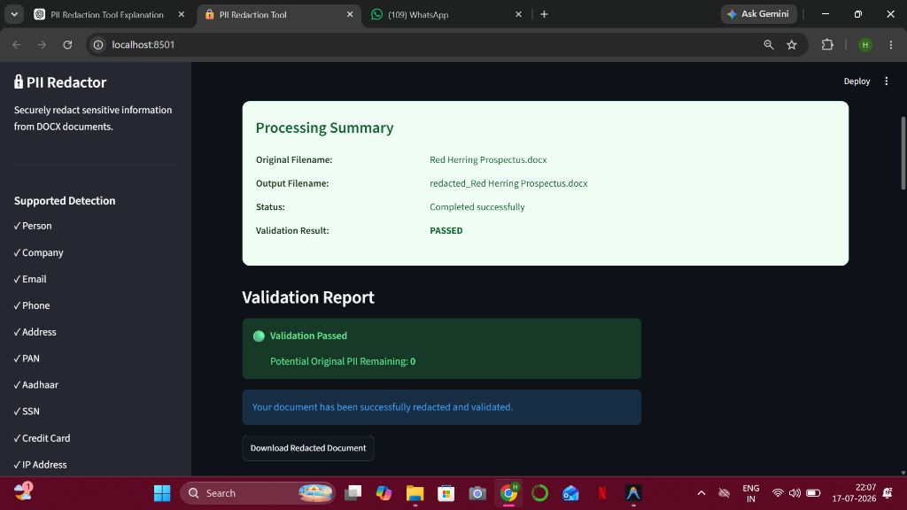

# PII Redaction Tool 🔒

A professional tool designed to securely detect and redact Personally Identifiable Information (PII) from Microsoft Word (.docx) documents, preserving the layout and formatting.

## Project Overview

The PII Redaction Tool scans paragraph blocks, table cells, and headers/footers in Word documents to identify sensitive entities. Detected entities are replaced with deterministic, contextually appropriate mock values (e.g., swapping a real name for a synthetic name, a real email for an `@example.com` domain, and standardizing formatting for PAN, Aadhaar, and phone numbers). It includes a post-redaction leakage scanner ensuring zero trace of the original PII remains in modified sections.

## Features

- **Format-Preserving DOCX Redaction:** Processes paragraphs, tables, and headers/footers while retaining font styles, sizes, colors, and layout.
- **Deterministic Synthetic Replacement:** Consistent names and identifiers receive matching mock values across the entire document.
- **Multi-Category NER Support:** Uses local NLP named entity recognition and regex checksum-valid patterns.
- **Post-Redaction Validation Rescan:** Verifies that no original PII remains in redacted sections before final save.
- **Production-Ready Exception Shielding:** Safe error messaging prevents raw PII or backend stack traces from leaking to standard logs or console output.
- **Interactive Streamlit Dashboard:** Modern upload preview, step-by-step progress tracking, metric analytics, validation banners, and download buttons.

## Supported PII

- **Person:** Proper names (deterministic replacements)
- **Company:** Corporate and organizational names
- **Email:** Email addresses (mapped to `@example.com`)
- **Phone:** Indian telephone and mobile formats (supporting country code whitespace, spaces, and dashes)
- **Address:** Complete postal addresses
- **PAN:** Permanent Account Number (Indian income tax ID)
- **Aadhaar:** 12-digit Indian national identity number (verifying Verhoeff checksum)
- **SSN:** US Social Security Numbers
- **Credit Card:** Standard 16-digit card formats (verifying Luhn check)
- **IP Address:** IPv4 formatting (mapped to documentation ranges)
- **DOB:** Dates of birth close to contextual keywords

## Project Architecture

### Detection Pipeline
1. **Traverser:** The `DocumentProcessor` parses the DOCX document and collects paragraphs and cell contents.
2. **Scanner:** The `PIIDetector` processes text segments using:
   - **NLP Models (spaCy):** Named entity recognition for Person/Company classes.
   - **Regular Expression Engines:** Checksum-valid matching for PAN, Aadhaar, SSN, Credit Cards, Emails, IP addresses, and Phone patterns.
3. **Overlap Resolver:** Deduplicates overlapping entity boundaries, prioritizing higher confidence classes.

### Replacement Pipeline
1. **Key Generation:** Generates unique memory keys combining entity type and normalized lower-case text.
2. **Deterministic Generator:** Generates context-appropriate mock values using Faker. Re-occurrences map to identical fake entries.
3. **Validation Rescan:** A `validate_redaction` checker ensures zero leaks remain in processed sections.

## Evaluation Results

Evaluation metrics achieved on the Prospectus Ground Truth benchmark:

- **Micro-Averaged Precision:** `100.00%` (0% false positives)
- **Micro-Averaged Recall:** `96.88%`
- **Micro-Averaged F1-Score:** `98.41%`
- **Exact Entity Accuracy (Exact Match):** `96.88%`

## Installation

Ensure you have Python 3.10+ installed.

1. Clone the repository:
   ```bash
   git clone <repository_url>
   cd pii-redaction-tool
   ```

2. Create a virtual environment and activate it:
   ```bash
   python -m venv venv
   # On Windows:
   venv\Scripts\activate
   # On macOS/Linux:
   source venv/bin/activate
   ```

3. Install the dependencies:
   ```bash
   pip install -r requirements.txt
   ```

4. Download the spaCy model:
   ```bash
   python -m spacy download en_core_web_sm
   ```
## Project Structure

```text
pii-redaction-tool/
│
├── input/                  # Input DOCX files (git-ignored except .gitkeep)
├── output/                 # Redacted output DOCX files (git-ignored)
├── evaluation/             # Manual ground truth annotations and evaluation script
├── scripts/                # Utility and verification scripts
├── src/                    # Core source codebase
│   ├── detectors.py        # PII detection algorithms
│   ├── document_processor.py # DOCX parsing utilities
│   ├── docx_redactor.py    # Orchestration and post-redaction validation
│   └── replacement_engine.py # Synthetic replacements generator
├── tests/                  # Backend unit & integration test suites
├── streamlit_app.py        # Streamlit web GUI dashboard
├── requirements.txt        # Production dependencies
├── LICENSE                 # License details
└── README.md               # Documentation (this file)
```

## Screenshots

### Homepage Configuration


### Live Processing Stepper


### Redacted Output & Validation Report


The Streamlit UI displays:
1. **Upload Preview:** Human-readable file metadata card.
2. **Stepper Progress Bar:** Live processing indicator.
3. **Summary Panel:** Clean success information block.
4. **Statistics Grid:** Multi-column metric cards showing totals.
5. **Download Box:** Direct link to output document.

## Future Improvements

- **GPU Acceleration:** Enhance pipeline performance for longer documents using GPU-bound NER engines.
- **Visual PDF Redaction:** Extend formatting preservation to PDF files using bounding box overlay replacements.
- **Multilingual Support:** Incorporate multilingual NLP models for non-English PII entities.

## License

Distributed under the MIT License. See `LICENSE` for details.
